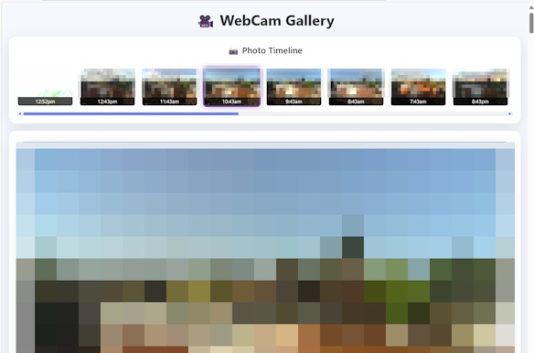
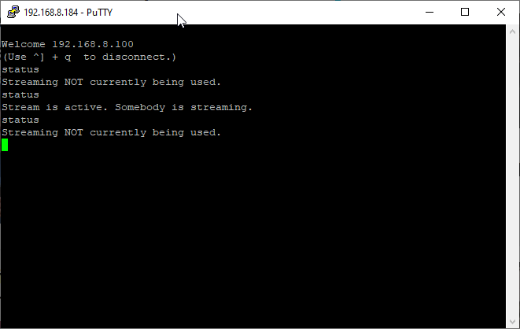

# ESP32-WebCam
 Streaming and static photo capture webcam with website.

 * Select 'AI Thinker ESP32-CAM' in Arduino to compile.
 * Based on 'RandomNerdTutorials' and the 'ESP32-Cam' repositories. 

 ## Functionality

 * Brightness / luminosity based photo capture. Only take photos during the day when the brightness is of a sufficient level.
 * Uploads captures periodically (based on configuration) to remote server as well as web stream.
 * Telnet interface to support basic diagnostics.

